<p align="center">
  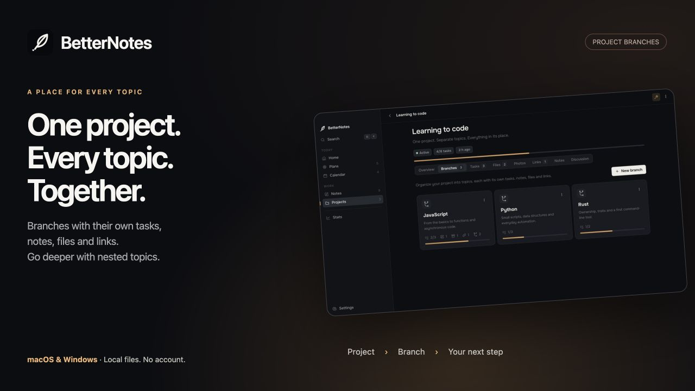
</p>

<h1 align="center">BetterNotes</h1>

<p align="center">
  Notes, projects with nested branches, plans and a week calendar.<br>
  One project for the big picture. One branch for each topic.<br>
  No account, no cloud, no subscription. Your data is a folder of ordinary files.
</p>

<p align="center">
  <a href="https://github.com/m1koz/betternotes/releases/latest"></a>
  
  
  
</p>

<p align="center">
  <a href="https://github.com/m1koz/betternotes/releases/latest/download/BetterNotes-macos.dmg"><b>⬇ Download for macOS</b></a>
  &nbsp;·&nbsp;
  <a href="https://github.com/m1koz/betternotes/releases/latest/download/BetterNotes-windows-setup.exe"><b>⬇ Download for Windows</b></a>
</p>

## One project. A place for every topic.

A course, a creative project or a long-term plan can have several directions at once. Keep the big picture in a project, then give each topic a **branch** with its own tasks, notes, files and links. Add nested branches when a topic needs more detail.

For example: **Learning to code → JavaScript → Functions**. The exercises, explanations and reference files stay together, while Python and Rust have their own spaces in the same project.

BetterNotes works on your computer without an account or subscription. Your notes and attachments are ordinary files in a local data folder. The five main sections are **Home**, **Plans**, **Calendar**, **Notes** and **Projects**.

## Download

| | Recommended | Also available |
|---|---|---|
| **macOS 11+** (Apple silicon & Intel) | [`BetterNotes-macos.dmg`](https://github.com/m1koz/betternotes/releases/latest/download/BetterNotes-macos.dmg) — open, drag to Applications | [`BetterNotes-macos.zip`](https://github.com/m1koz/betternotes/releases/latest/download/BetterNotes-macos.zip) — the `.app` itself, unzip anywhere |
| **Windows 10 / 11** | [`BetterNotes-windows-setup.exe`](https://github.com/m1koz/betternotes/releases/latest/download/BetterNotes-windows-setup.exe) — the installer, adds Start menu and uninstall entries | [`BetterNotes-windows.zip`](https://github.com/m1koz/betternotes/releases/latest/download/BetterNotes-windows.zip) — portable, keeps its data next to the `.exe` |

All builds are on the [Releases](https://github.com/m1koz/betternotes/releases) page and in the [`dist/`](dist) folder of this repository. On a Mac take the `.dmg`, on Windows the `-setup.exe`.

To verify a download:

```bash
shasum -a 256 -c BetterNotes-macos.dmg.sha256
```

> **macOS:** the app is distributed outside the App Store and is not notarized, so the first launch may say *"BetterNotes cannot be opened"*. Open **System Settings → Privacy & Security** and click **Open Anyway**, or run once in Terminal:
> ```bash
> xattr -dr com.apple.quarantine /Applications/BetterNotes.app
> ```
>
> **Windows:** SmartScreen may show *"Windows protected your PC"* because the installer is not signed with a paid certificate yet. Click **More info → Run anyway**. The installer is built from the same application code as the macOS app.

## What's inside

### Projects and branches

Open a project and choose **Branches**, immediately after **Overview**. Create a topic, open it and keep the work for that topic together.

<p align="center">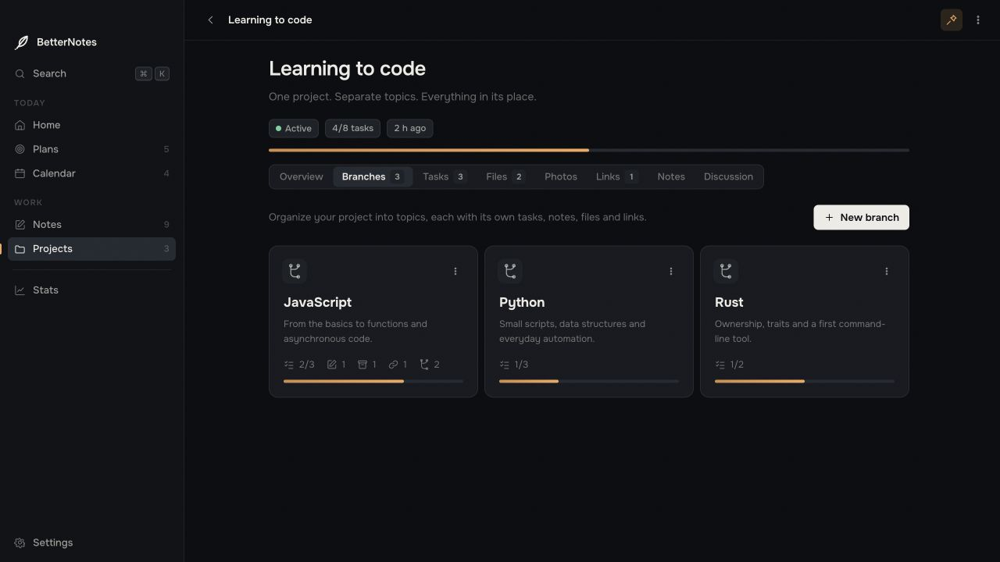</p>

**Go deeper when you need to.** A branch can contain nested branches. Here, JavaScript contains **Functions** and **Async & await**; the breadcrumb path lets you return to any parent topic.

<p align="center">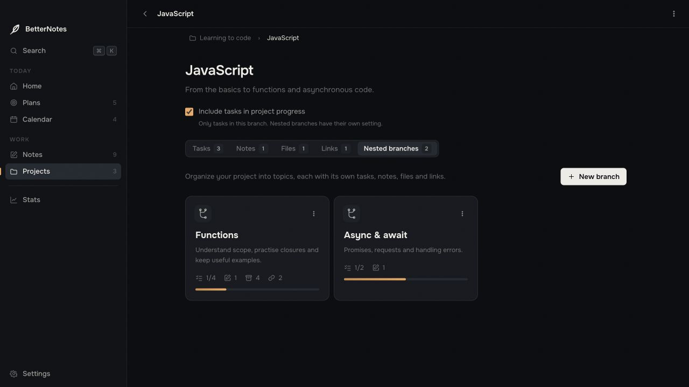</p>

**Give each topic its own work.** Every branch has tasks, notes, folders, files and links. Tasks can have deadlines and their own notes, links and attachments too.

<p align="center">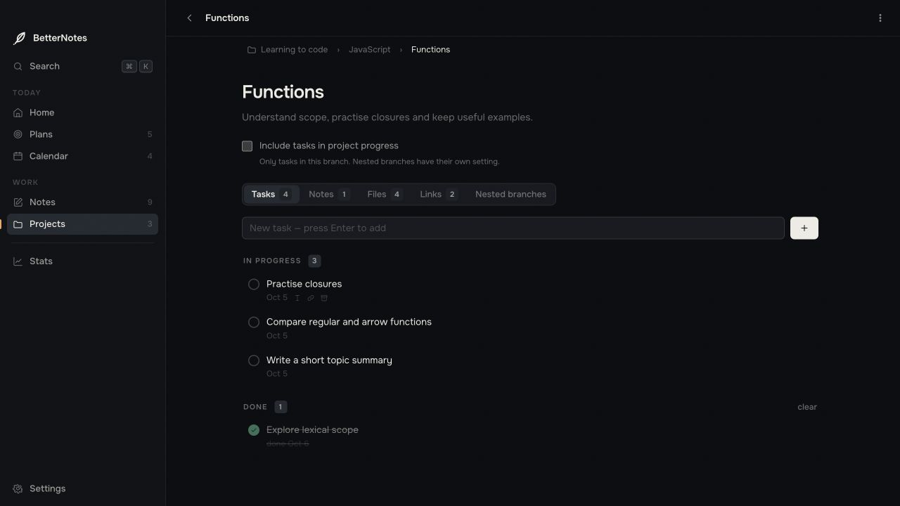</p>
<p align="center">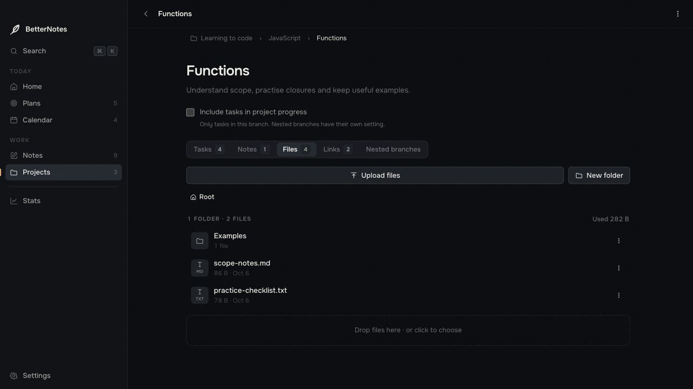</p>

**Choose what counts toward the project.** Branch tasks are excluded from project progress by default. Turn on **Include tasks in project progress** for the branches you want to count. Each nested branch has its own setting. Task deadlines appear in **Plans** and **Calendar** regardless of that setting.

**Find and keep everything.** Search includes branch names and contents, including the text of attached files. Full exports and backups include the entire branch structure and its attachments.

Project-wide work stays in the main project tabs. Projects also include a photo wall, discussion, links and an overview of progress.

<details>
<summary>See the main project’s tasks and files</summary>

<p align="center">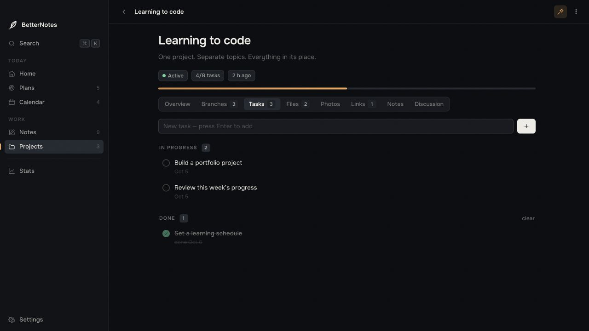</p>
<p align="center">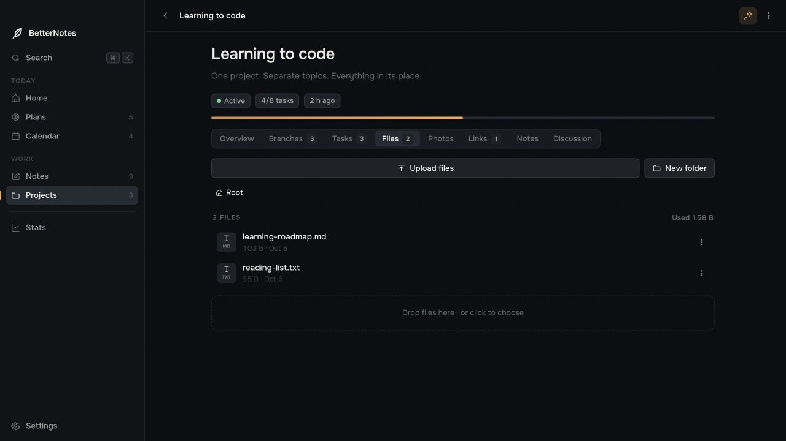</p>

</details>

### Notes
Rich text with headings, lists and checklists, pictures you resize with the mouse, tags, comments and pinning. Highlight important passages with presets or any custom colour, or change the text colour. Colour stops at the end of the highlighted passage when you continue typing. **Remove colour** clears the selected text colour and highlight while keeping bold, italic and other formatting. A note can live on its own, in a project, or in a project branch.

<p align="center">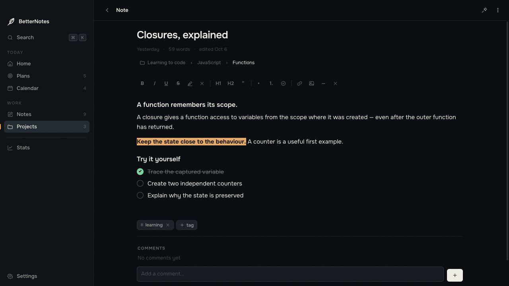</p>

### Calendar
A week by hours. Click a free slot to create an event, give it a description and a color, drag it to another time or day, pull the bottom edge to make it longer. Task deadlines and daily goals show up in the *all day* strip.

<p align="center">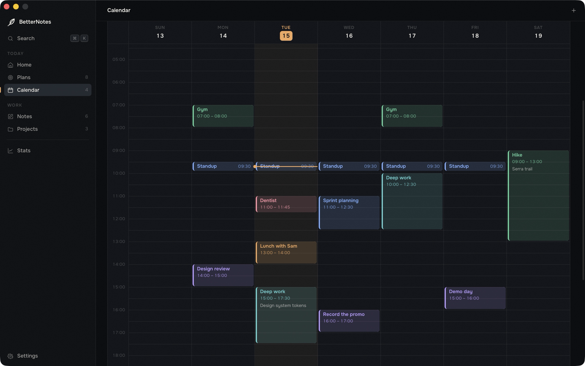</p>

### Plans
Goals by day, week, month and year. A goal breaks down into the periods inside it; progress rolls up from the bottom, so ticking off a day moves the week, the month and the year. Pick two dates and BetterNotes chooses the horizon for you. Log what you did each day and turn the log into a report note with one click. Tasks from project branches appear on their due dates, with the full topic path.

<p align="center">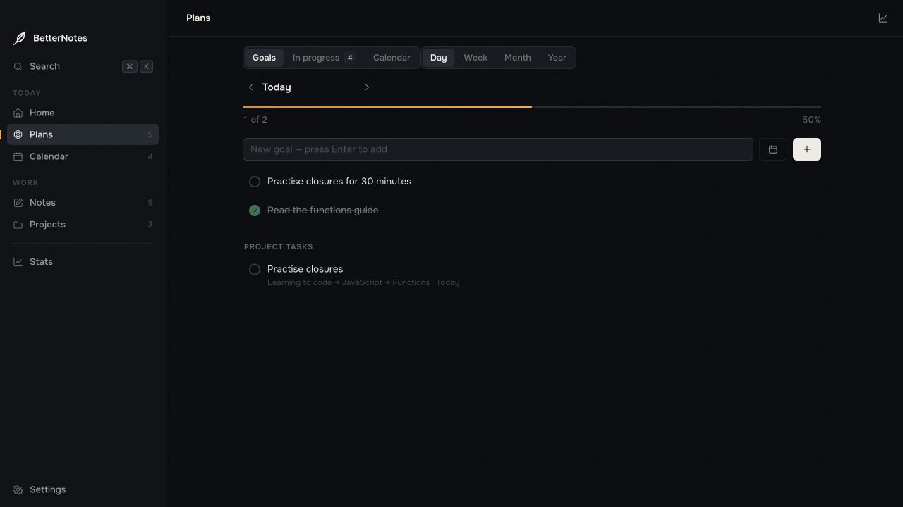</p>

### Home and search
Home greets you by name and gathers what is coming up: goals, today's events, pinned notes and active projects. **⌘K / Ctrl+K** searches everything — notes, tasks, events, goals, links, and the contents of text files you attached. Results from branches show the full project and topic path, so you can jump straight to the right workspace.

<p align="center">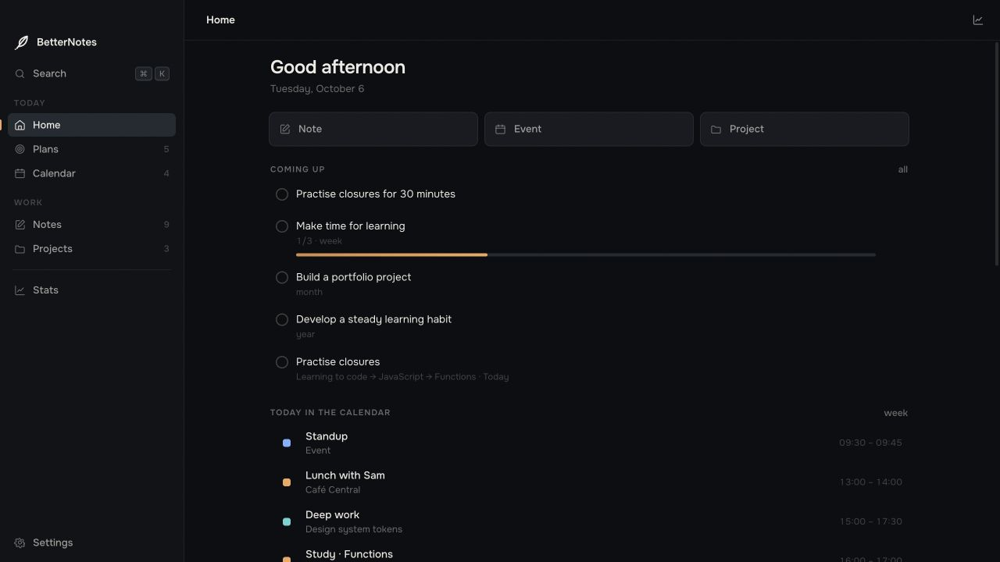</p>
<p align="center">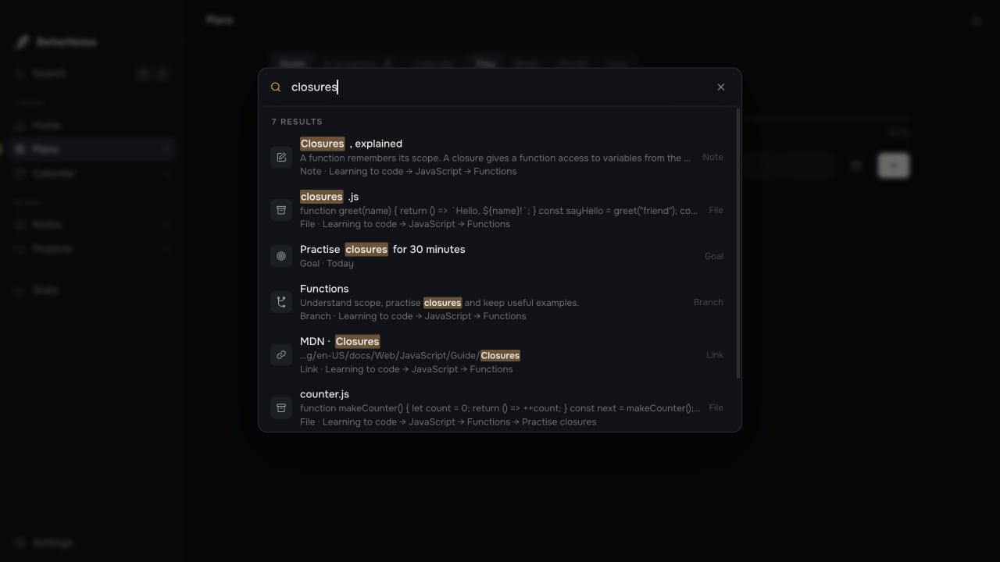</p>

### Dark or light, in ten languages
Two themes that follow the system or your choice. The interface is available in English, Русский, Українська, Deutsch, Français, Español, Italiano, Português, 中文 and 日本語; on first launch BetterNotes takes the language of your system.

<p align="center">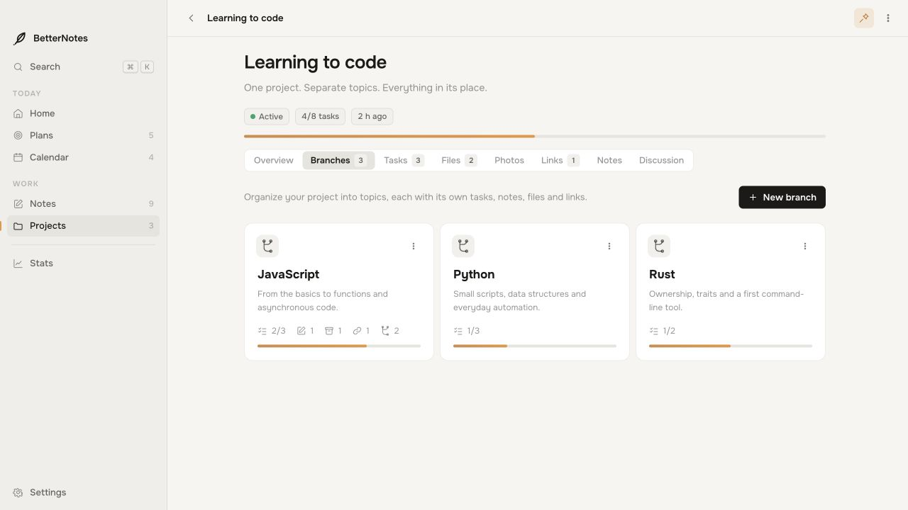</p>

## Updates and app removal

Open **Settings → Update and removal → Check for updates** to install the latest release. BetterNotes verifies the update signature, saves a safety copy of the app and data, and restarts after installation. Notes, projects, branches and attachments stay in place.

**Remove app** in the same section removes the application and closes it. Your data and backups remain available if you reinstall. On macOS the app goes to the Trash; on Windows an installed copy uses its uninstaller, and a portable copy goes to the Recycle Bin.

<p align="center">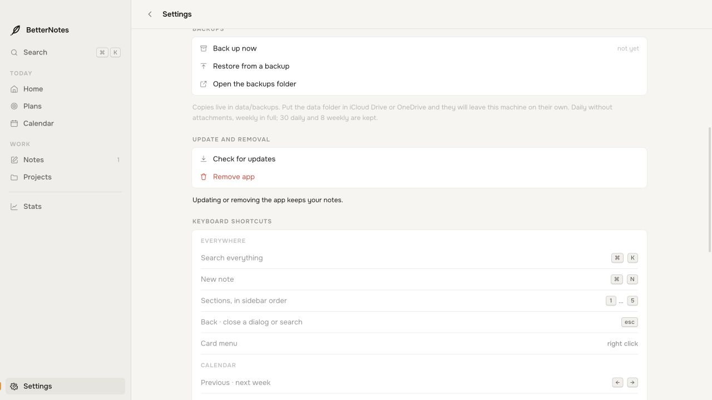</p>

Versions before 1.2.1 need one manual update to get these controls.

## Your data

All screenshots use fictional example content. **A fresh installation starts with empty notes, projects, plans and calendar events.**

```
data/
  betternotes.json   notes, projects, plans, events, settings
  blobs/             attachments — photos and files, as they are
  text/              text of attached files, for search
  backups/           copies the app writes on its own
```

- **Where:** next to the app, if that folder is writable. Apps installed into `/Applications` or `Program Files` keep their data in the user folder instead; the exact path is always shown in **Settings → Data**, with *Open data folder* and *Move…* buttons.
- **Backups:** a daily copy without attachments and a weekly one with everything, 30 and 8 kept. **Settings → Backups** makes a copy right now, restores any of them, opens the folder.
- **Moving between computers:** *Export to file* on one, *Import from file* on the other — Mac or Windows, it does not matter. Or just copy the `data` folder.
- **Local data.** Notes and attachments stay on your computer. The app works offline; an optional fallback font may load from Google Fonts when online. Checking for updates contacts this GitHub repository and sends no notes or attachments.

## Keyboard shortcuts

| | |
|---|---|
| `⌘K` / `Ctrl+K` | search |
| `⌘N` / `Ctrl+N` | new note |
| `1` … `5` | sections |
| `←` / `→` | previous / next week in the calendar |
| `Esc` | back / close |
| `⌘↩` / `Ctrl+Enter` | send a comment |
| right-click | card menu |
| click a picture | select; drag the corner to resize, `Shift` for free aspect, `Alt+←/→` by 10 %, double-click for original |

The full list is in **Settings → Keyboard shortcuts**.

## Built with

<p>
  
  
  
</p>

BetterNotes uses **Rust** and [Tauri 2](https://tauri.app) for the native window, file storage, attachments, backups and system dialogs on both macOS and Windows. The interface uses **JavaScript, HTML and CSS** in the system WebView and is embedded in the application binary. **Python** is used for development tools and artwork generation; users do not need Python or npm.

This repository contains ready-to-use applications (`dist/`), screenshots (`assets/`), release notes and the license. The application source is not published.

## FAQ

**What is a project branch?** A topic inside a project with its own tasks, notes, files, folders and links. It can contain nested topics, and you choose whether its tasks contribute to the project’s progress.

**Is it free?** Yes. No trial, no in-app purchases, no telemetry.

**Where is the source?** BetterNotes is freeware, not open source. This repository holds ready-to-use releases, screenshots and documentation. The application source is not published.

**Why does GitHub show “Source code” downloads?** GitHub generates ZIP/TAR archives of every tagged repository automatically. Here they contain the distribution files and documentation, not the application source. Use the recommended installers above.

**Does it sync?** Not yet. Put the `data` folder in iCloud Drive, OneDrive or any synced folder and it will follow you; real device-to-device sync is on the roadmap.

**How do I update?** In 1.2.1 and later, use **Settings → Update and removal → Check for updates**. For an older version, download the new installer or replace the Mac app once, keeping your existing data folder. Manual downloads remain available for every release.

**Can I change the font?** The app ships with the system font. If you own *TT Norms Pro*, BetterNotes will pick it up — see **Settings → About**.

**Something broke.** Open an [issue](https://github.com/m1koz/betternotes/issues) or write to [t.me/mkships](https://t.me/mkships).

## License

BetterNotes is free to download and use under the [End User License Agreement](LICENSE). © 2026 m1koz. All rights reserved.
